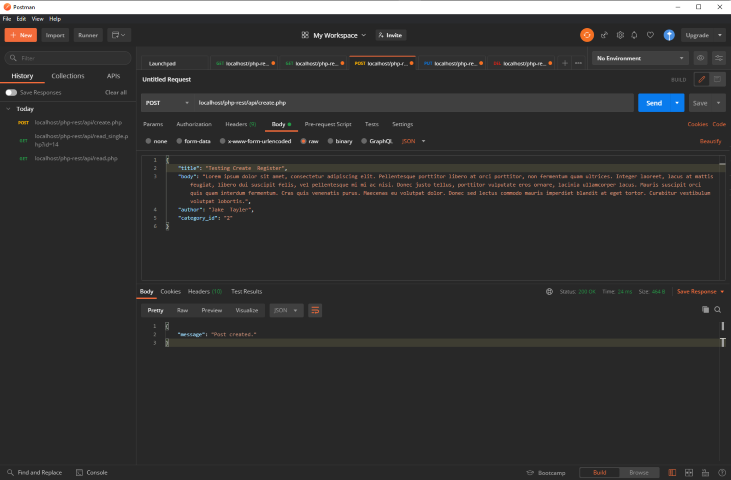

# ** API Rest em PHP**
Este é um projeto Rest API desenvolvido utilizando a linguagem PHP e banco de dados MySQL.

## **Sobre o projeto:** 

Desenvolvi este projeto de API afins de estudo da linguagem PHP e o banco de dados MySQL aplicando a arquitetura Rest. No decorrer do desenvolvimento tive dificuldade para identificar um erro em meu arquivo que gerava a conexão com o banco de dados, com a correção todo o resto do processo de desenvolvimento foi mais facil, tendo em sua grande maioria erros durante a escrita das querys dentro do PHP. 

### O que aprendi? 

- Integração da linguagem de programação com o banco de dados; 
- Como funciona a arquitetura Rest e sua versatidade; 
- Métodos HTTP (GET, POST, PUT e DELETE);
- Teste de requisições utilizando o Postman(ferramenta para teste de requisições a API's Rest);

### Função para ler todos os registros no banco de dados.

----------

### Função para ler o registro sinne no banco de dados.

----------

### Função para criar um registro no banco de dados.

----------

### Função para atualização de registro no banco de dados.

----------

### Função para excluir registro no banco de dados.

----------

Todo o projeto foi desenvolvido seguindo o tutorial do Canal [ProgrammingKnowledge](https://youtu.be/dlGtSoigdB0?list=PLS1QulWo1RIYWjdoEC1WbT8W3XGGWVXfW)